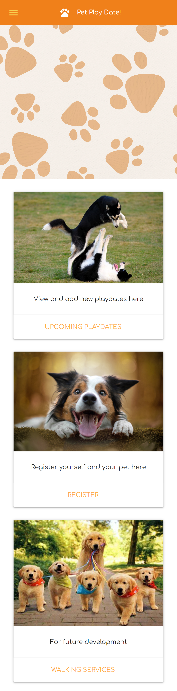
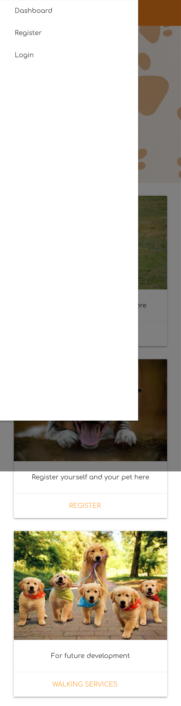

# Pet Playdate!

## Description

The motivation and purpose behind this project was to create an app that can be used to register and keep track of playdates. The app allows users to create an account, or login with existing credentials. Once logged in the user can register new pets and use those pets to create playdate events.

It solves the issue of not having an app that can keep track of upcoming playdates. We learned a lot about linking the front end development to back end, as well as using a new styling database.

## Table of Contents

- [Installation](#installation)
- [Usage](#usage)
- [Credits](#credits)
- [License](#license)
- [Features](#features)

## Installation

Nothing needs to be installed! Just head to the heroku link to get started!

## Usage

Heroku deployment: [here](https://morning-journey-92654.herokuapp.com/home)

Desktop/tablet view:

Mobile view:

## Credits

Leon F. [https://github.com/hope428](https://github.com/hope428)

Brian C. [https://github.com/BrianSChapman](https://github.com/BrianSChapman)

Morgan D. [https://github.com/M-Dickerson](https://github.com/M-Dickerson)

## License

MIT License

A short and simple permissive license with conditions only requiring preservation of copyright and license notices. Licensed works, modifications, and larger works may be distributed under different terms and without source code.

## Features

- Login and signout features. Once your account is created, all your data gets saved to your profile!
- A hamburger menu displays in the navbar for easy page switching
- A dashboard complete with upcoming events, a small biography of your registered pets, and an area to create new playdate events!